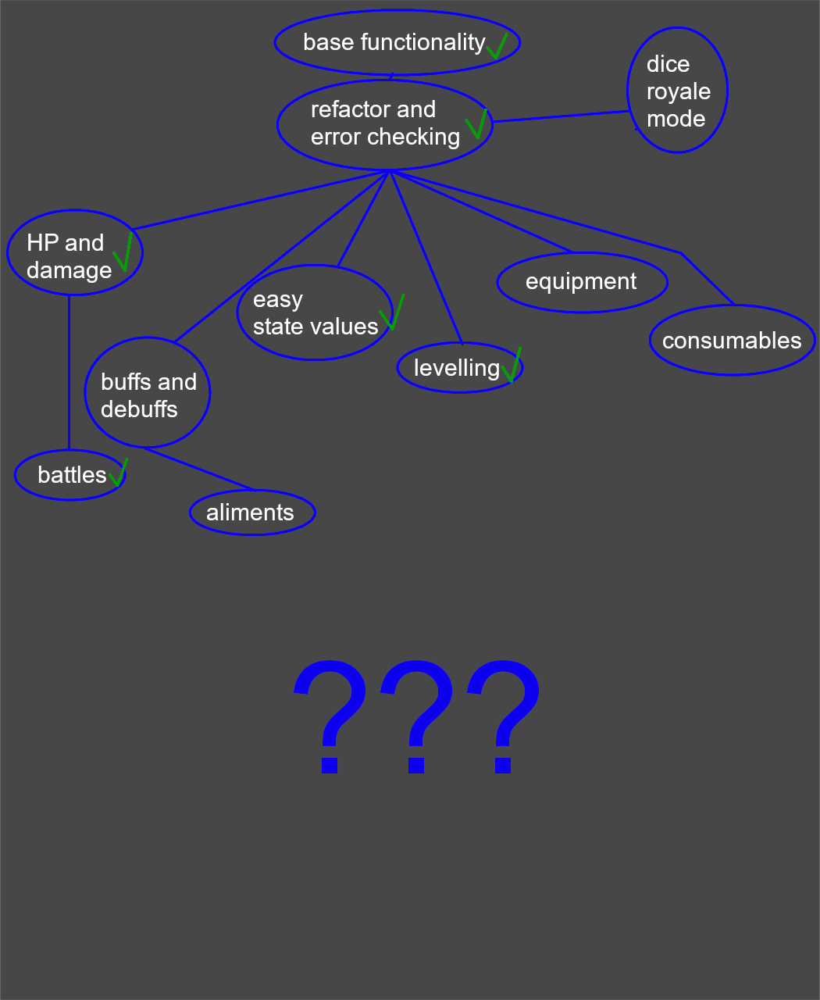

## Description

This project gives you tools to play AI Dungeon like an RPG loosely based on Dungeons&Dragons.

[Installation Guide](#installation).

# COMMANDS

The script will utilize only the first command in the input to avoid bugs.

## !addCharacter

Syntax: `!addCharacter(name, stat = value, stat2=value, stat3 = value, ..., statN=value, $item1, $item2..., $itemN)`

Creates a character with given stats.
There can be additional whitespace around "=" sign, but nowhere else.

You can specify hp and level the same way.

Allowed characters for the characters' names are: all latin characters, numbers, 
whitespace characters and ' (apostrophe).

Item names **must** be preceded with `$` in addCharacter and addNPC commands.

If another character already has or had a stat not mentioned here, it is set to starting value.

## !addNPC

Syntax: `!addNPC(name, stat = value, stat2=value, stat3 = value, ..., statN=value, $item1, $item2..., $itemN)`

Creates an NPC with given stats.

Works the same way !addCharacter does, but:

-   NPCs die when they are killed (AKA they are deleted)
-   NPCs don't level
-   NPCs attack automatically in battles, targeting a random enemy

## !setStats

Syntax: `!setStats(character, stat = value, stat2=value, stat3 = value, ..., statN=value)`

Sets an already created character's stats. 
Please avoid changing things like HP and level here. 
There can be additional whitespace around "=" sign, but nowhere else.

Outputs stat changes.

## !showStats

Syntax: `!showStats(character)`

Shows stats of a specified character.
Works only on created characters.

## !levelStats

Syntax: `!levelStats(character, stat + value, stat2+value, stat3 +value, ..., statN+value)`

Uses acquired skillpoints to increase stats. 
Works only when not levelling to oblivion.

## !skillcheck

Syntax: `!skillcheck(stat, name, thresholds)`

### Thresholds syntax

    a) number - outcome - success or failure
    b) number : number - outcome - success, nothing happens, failure
    c) number : number : number - outcome - critical success, success, failure, critical failure
    d) number : number : number : number - outcome - critical success, success, nothing happens, failure, critical failure
    e) number = outcome1 : number = outcome2 : number = outcome3 : ... : number = outcomeN - custom outcomes. If score is lower than the lowest threshold, nothing happens.

Stat must be an already created one. Stats are automatically created when they are set on any character. If you create a character with a new stat, others don't have it automatically set. When stat is not set, it is assumed its value is 0.

If you use skillcheck on a dead character, they are tested as if all of their stats were  5 levels lower (adjustable by `!setstate`). 
Can be also turned off in the code.

## !addItem

Syntax: `!addItem(name, slot, stat = value, stat2=value, stat3 = value, ..., statN=value[, target, character])`

Creates an item with given modifiers.

Target (optional) - can be either `inventory` or `equip`. When unspecified item will be simply created, `inventory` will put it into party's inventory, and `equip` will instantly equip it on specified character.

Character (must be given when target is set to `equip`) - specifies which character will equip the item.

If a character has something in the slot, the item will be unequipped to inventory.

## !alterItem

Syntax: `!alterItem(name, slot, stat = value, stat2=value, stat3 = value, ..., statN=value)`

Alters slot and modifiers of previously created item.

## !gainItem

Syntax: `!gainItem(name[, character])`

Puts a previously created item in inventory, or a character equips it when `character` is specified.

If a character has something in the slot, the item will be unequipped to inventory.

## !equip

Syntax: `!equip(character, items)`

Character equips items from inventory.

If a character has something in the slot, the item will be unequipped to inventory.

## !unequip

Syntax: `!unequip(character, slots)`

Puts items from slots into inventory.

## !showInventory

Syntax: `!showInventory()`

Shows inventory's contents.

## !attack

Syntax: `!attack(attacking character, attacking stat, defending character, defending stat)`

While characters will be created with default stats, used stats need to be created BEFORE calling this command. 
You can view and edit damage calculation at the top of input modifier. Additional info is provided there. 
Default calculation: attacker's stat + score of rolling a 20-sided dice - defender's stat.

Instead of outputting something, it changes the input the way skillcheck does.

## !sattack

Syntax: `!sattack(attacking character, attacking stat, defending character, defending stat, dodging stat)`

Main difference between this command and `!attack` is that before dealing damage script checks if the defending character dodged the damage. 
Default dodge: both characters roll a 5-sided dice and att their stats (attacking and dodging). Defending character dodged if their score is greater than the attacker's. 

While characters will be created with default stats, used stats need to be created BEFORE calling this command. 
You can view and edit damage calculation at the top of input modifier. Additional info is provided there. 
Default calculation: attacking stat + score of rolling a 20-sided dice - defending stat.

Instead of outputting something, it changes the input the way skillcheck does.

## !battle

Syntax: `!battle((character1, character2, ...), (character8, character9, ...))`

Starts a battle between characters in the first and second bracket pair.

Battle automatically sets which side and character attacks at the moment, and makes the NPCs attack their enemies.

During battle you can only:

-   retreat by writing escape, retreat or exit anywhere in the input
-   attack a character from the other side of the battle with `(character)` or `(attacking stat, character, defending stat)`; if you are dodging by default, attacked character will try to dodge with defending stat used as dodging stat

## !heal

Syntax: `!heal(character, <d>value)`

Character must be created and not dead (its hp must be more than 0).

Healing value can be preceded by "d" to roll an n-sided dice.

Outputs healing value and resulting hp.

Examples: 
`!heal(Zuibroldun Jodem, 100)` - will heal Zuibroldun Jodem by 100 hp (unless they do not exist or are dead) 
`!heal(Zuibroldun Jodem, d100)` - will heal Zuibroldun Jodem by 1 to 100 hp 
`!heal(Zuibroldun Jodem, 50:100)` - wil heal Zuibroldun by 50 to 100 hp

## !revive

Syntax: `!revive(reviving character, revived character, value)`

Transfers value of hp from reviving to revived character. 
It works both as reviving and transfusion tool. 

Outputs both characters' resulting hp.

Reviving character must exist and have at least value+1 hp to perform this action. 
Revived character must exist.

## !getState

Syntax: `!getState()`
Outputs current state.
You can use this alongside with setState as saves, but currently there is no way to do it differently than by manually copying it to a file on non-volatile storage, like your hard drive, and then setting it back. This also allows for making your custom state to use in all adventures.

## !setState

Syntax: `!setState(state as json)`

Sets state to the json if it has proper format.

Outputs only error messages.

WARNING: do not change the values you get from `!getState` unless you know what you're doing! 
Guide to creating custom states is below.

Note: all commands are case-insensitive. 
Thanks to refactor the newest version will throw errors and cut commands from what the AI sees even when something goes wrong.

---

# Levels and leveling

You can change how much xp is needed to level up in shared library script. 
You can change whether you want to level your stats 
or characters and distribute skillpoints with `!levelStats`(default) in input modifier script. 
You can only do it before creating the first character.

The amount of skillpoints granted for level up can be adjusted by `!setstate`.

---

# Tips and tricks

-   when using `!skillcheck` without custom outcomes, I recommend using it like
    `Antonio tries to do something. !skillcheck(...)`
-   the same applies to other commands that don't generate output, like `!attack` and `!sattack`
-   after deletion of custom output, produced by some commands, fe. `!showStats`, write something of your own to "clear cache" of the script
-   before starting the adventure use [AID state creator](https://github.com/Gutek8134/AID-state-creator) and set everything with `!setState` instead of using other commands, so the AI won't try to mimic them and you will save time

---

# Custom states

## Section moved to [Developers note](/Developers%20note.md#explanations)

# Feature roadmap

You can vote on what do you want me to do next [here](https://forms.gle/SqfzW5hZjzNZDVH37)

---

# Installation

[Video tutorial](https://youtu.be/rwzCD6qZLi4)

1. Create a scenario.
2. Get into Scripts menu. (You need to use browser for this.)
3. Copy files contents to corresponding fragments: sharedLibrary.js to Shared Library, inputModifier.js to Input Modifier and so on.
4. Adjust the in-script settings. They are: damageOutputs, ignoreZeroDiv, shouldPunish, levellingToOblivion, defendingCharacterLevels in Input Modifier and damage, dodge, and experienceCalculation functions in Shared Library.
5. Play the created scenario. You should now be able to use the commands.
